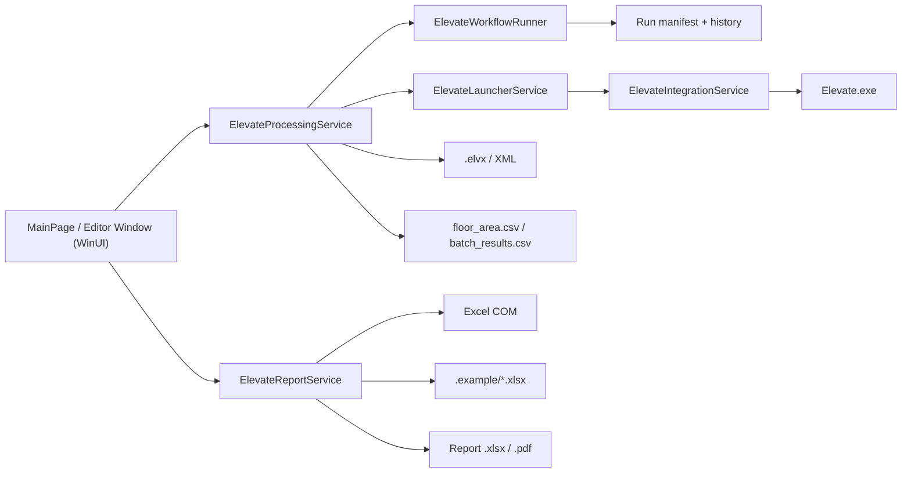

# Elevate Helper (WinUI 3)

Desktop-приложение для автоматизации работы с Peters Research Elevate на Windows:

- подготовка `.elvx` проектов для `Office`, `Residence` и `Hotel`;
- запуск пакетных расчетов Elevate;
- отслеживание прогресса и результатов расчета;
- генерация Excel/PDF-отчетов по шаблонам из `.example`;
- встроенное редактирование `.elvx` проектов с проверкой связанных параметров.

## Инструкция пользователя

Подробная инструкция по работе с приложением находится в [docs/USER_GUIDE.md](docs/USER_GUIDE.md).

## Что умеет

- Автоматически создает расчетные копии `.elvx` и меняет XML-параметры:
  - `HandlingCapacity`;
  - `BuildingType`;
  - `SplitUp` / `SplitDown` / `SplitInterfloor`;
  - `JobTitle` для утреннего и обеденного office-сценариев.
- Запускает сценарии:
  - `Run` для полного расчета;
  - `Run Morning Only` для Office;
  - `Print Report`, `Print Morning Report`, `Print Lunch Report`;
  - печать отчетов из карточки завершенного задания.
- Не допускает параллельный запуск двух расчетов для одной и той же рабочей папки.
- Формирует отчеты без VBA-макроса: данные читаются из `batch_results.csv`, step CSV и исходного `.elvx`, затем записываются в Excel-шаблон и экспортируются в PDF через Microsoft Excel COM.
- Определяет ширину и тип дверей в отчете по фактическим `DoorOpenTime`, `DoorCloseTime` и `DoorPreOpening` из `.elvx`.
- Ведет manifest запуска:
  - `.elevate-helper-run.json` — последний запуск;
  - `.elevate-helper-runs/*.json` — история запусков;
  - внутри сохраняются шаги workflow, статус, ошибка и найденные артефакты.
- Поддерживает retry упавших задач из карточки задания.
- Поддерживает досрочную остановку активной задачи без перевода ее в ошибку.
- Позволяет убрать из очереди завершенные, остановленные и ошибочные карточки.
- Дает явный выбор режима `Один проект / Пакет`: редактор доступен для одной рабочей папки, пакетный режим — для корня проекта.
- Показывает установленную версию в верхней панели и при запуске предлагает установить свежий GitHub-релиз, если он новее текущего.

## Архитектура



## Требования

- Windows 10/11 x64.
- Установленный Peters Research Elevate (`Elevate.exe`).
- Microsoft Excel для генерации `.xlsx` и `.pdf` отчетов.
- .NET SDK 10 для разработки и тестов.
- Inno Setup 6 нужен только для локальной сборки installer `.exe`.

Release-сборки публикуются self-contained для .NET и Windows App SDK, поэтому отдельная установка Windows App Runtime на тестовой машине не требуется.

Elevate Helper ищет `Elevate.exe` через:

- переменную окружения `ELEVATE_EXE_PATH`;
- Windows Registry (`App Paths`, `Uninstall`);
- стандартные папки `Program Files`;
- `PATH`.

## Быстрый старт

На Windows:

```powershell
dotnet restore .\ElevateHelperWinUI.csproj
dotnet build .\ElevateHelperWinUI.csproj --configuration Release -p:Platform=x64
dotnet run --project .\ElevateHelperWinUI.csproj -p:Platform=x64
```

Для тестов:

```powershell
dotnet test .\tests\ElevateHelper.Tests\ElevateHelper.Tests.csproj --configuration Release
```

## Использование

1. Укажи папку с исходным `.elvx`.
2. Выбери тип здания: `Office`, `Residence` или `Hotel`.
3. Нажми `Run` или `Run Morning Only`.
4. Дождись завершения задания в списке `Checkup`.
5. Нажми кнопку печати отчета у завершенного задания или используй отдельные кнопки report.

Для Office полный запуск создает папки `morning` и, при включенном lunch-сценарии, `lunch`. Для Residence/Hotel расчет идет в выбранной папке.

## Пакетный режим проекта

Выберите режим `Пакет`, чтобы запустить несколько групп из корневой папки проекта без ручного выбора типа здания. Анализ пути может рекомендовать режим, но не переключает интерфейс автоматически. Ожидаемая структура:

```text
Project/
├─ Office/
│  ├─ G1/
│  │  └─ *.elvx
│  └─ G2/
│     └─ *.elvx
├─ Res/
│  └─ G1/
│     └─ *.elvx
└─ Hotel/
   └─ G1/
      └─ *.elvx
```

Правила:

- в каждой папке группы должен быть один исходный `.elvx`;
- `Office` запускается с утренним и обеденным пиком;
- `Res` запускается как `Residence`;
- `Hotel` запускается как `Hotel`;
- количество параллельных расчетов задается перед запуском, также доступен режим без ограничения;
- Excel/PDF-отчеты формируются автоматически после завершения расчета и сохраняются в корень проекта;
- генерация отчетов выполняется последовательно, чтобы не запускать несколько Excel COM export одновременно;
- если `.elvx` найден вне `Office` / `Res` / `Hotel`, приложение открывает диалог выбора типа здания.

## Редактор ELVX

Выберите режим `Один проект`, укажите рабочую папку и откройте отдельное окно редактора `.elvx`.

Редактор умеет:

- загружать существующий `.elvx`;
- создавать проект из шаблона для выбранного типа здания;
- редактировать проект, анализ, пассажиропоток, здание, этажи, лифты и двери;
- сохранять новый `.elvx` в рабочую папку;
- открываться как отдельное окно редактора.

## Отчеты

Для отчетов используются шаблоны из `.example`:

```text
.example/
├─ Office.xlsx
├─ Residential.xlsx
├─ Hotel.xlsx
├─ Office.elvx
├─ Residential.elvx
└─ Hotel.elvx
```

Папка `.example` включается в publish output и release packages. Скрипт релиза проверяет наличие обязательных шаблонов перед сборкой.

Выходные файлы отчета создаются в корне выбранной папки проекта:

- `<Project> <Building>.xlsx`;
- `<Project> <Building>.pdf`.

Для Office-сценариев `morning` и `lunch` отчеты также сохраняются в корень проекта, а к имени файла добавляется суффикс сценария, чтобы утренний и обеденный отчеты не перезаписывали друг друга:

- `<Project> <Building> morning.xlsx`;
- `<Project> <Building> lunch.xlsx`.

## Workflow и диагностика

Каждый запуск проходит через шаги:

1. `Validate inputs`
2. `Prepare scenarios and run Elevate`
3. `Collect artifacts`

Состояние сохраняется в JSON:

```text
<work folder>/.elevate-helper-run.json
<work folder>/.elevate-helper-runs/<runId>.json
```

Manifest помогает понять, на каком шаге упал расчет, какие файлы были найдены и какие параметры использовались для запуска. Это основа для дальнейшего UI retry/history.

## Сборка release

Portable zip:

```powershell
.\scripts\build-release.ps1 -Tag v2.0.4 -Runtime win-x64 -Configuration Release
```

Installer:

```powershell
.\scripts\build-installer.ps1 -Tag v2.0.4 -Runtime win-x64 -Configuration Release
```

GitHub Actions release workflow собирает:

- `ElevateHelper-win-x64-<tag>.zip`;
- `ElevateHelper-win-x64-<tag>-setup.exe`.

Теги с дефисом, например `v2.0.2-preview.11`, публикуются как GitHub prerelease.

## CI

Workflow: `.github/workflows/ci.yml`

- `Unit Tests` на Ubuntu: restore + test.
- `Build WinUI App` на Windows: restore + build `ElevateHelperWinUI.csproj`.

## Структура проекта

```text
.
├─ Models/                     # DTO, enum, run manifest
├─ Services/                   # Интеграция, workflow, запуск, отчеты, редактор
├─ Views/                      # WinUI страницы и окна
├─ .example/                   # ELVX/XLSX шаблоны и reference-файлы
├─ scripts/                    # Release/installer scripts
├─ docs/releases/              # Release notes
├─ tests/ElevateHelper.Tests/  # xUnit tests
└─ .github/workflows/          # CI и Release automation
```

## Частые проблемы

- `Peters Research Elevate is not detected`:
  - проверь установку Elevate или задай `ELEVATE_EXE_PATH`.
- `Unable to start Elevate.exe`:
  - проверь путь к Elevate и права запуска.
- Elevate Helper не может управлять окном Elevate:
  - запусти Elevate Helper и Elevate с одинаковыми правами пользователя.
- `Microsoft Excel COM is not available`:
  - установи Microsoft Excel на Windows-машине, где формируется отчет.
- `.example` или шаблон не найден:
  - используй release build или проверь, что папка `.example` лежит в корне репозитория при запуске из исходников.
- `MSB3021` / `MSB3027` при сборке:
  - закрой запущенный `ElevateHelperWinUI.exe`, он блокирует выходной файл.

## Лицензия

MIT, см. файл `LICENSE`.
