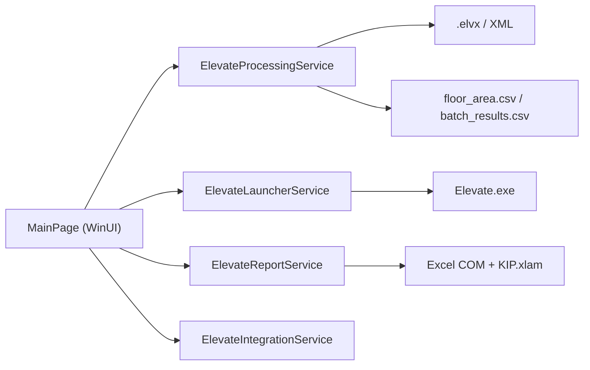

# Elevate Helper (WinUI 3)

Desktop-приложение для автоматизации сценариев в Peters Research Elevate:
- подготовка `.elvx` файлов под Office/Residence/Hotel;
- запуск расчетов Elevate;
- генерация Excel-отчетов через VBA-макросы `KIP.xlam`.

## Что умеет

- Выбор типа здания: `Office`, `Residence`, `Hotel`.
- Автоматическая подготовка копий `.elvx` и модификация XML-параметров:
  - `HandlingCapacity`;
  - `BuildingType`;
  - распределение `SplitUp/SplitDown/SplitInterfloor`;
  - `JobTitle` для peak-сценариев.
- Отдельные сценарии:
  - `Run` (полный запуск);
  - `Run Morning Only` (для Office);
  - `Print Report` / `Print Morning Report` / `Print Lunch Report`.
- Генерация отчета в Excel по шаблону:
  - `Office.xlsx`
  - `Hotel.xlsx`
  - `Residential.xlsx`

## Архитектура



## Требования

- Windows 10/11 x64.
- Установленный Peters Research Elevate (`Elevate.exe`).
- Microsoft Excel (для печати отчетов через `KIP.xlam`).
- .NET SDK 8+ (в CI используется .NET SDK 10).

## Быстрый старт

```powershell
dotnet restore ElevateHelperWinUI.csproj
dotnet build ElevateHelperWinUI.csproj -p:Platform=x64
dotnet run --project ElevateHelperWinUI.csproj -p:Platform=x64
```

## Использование

1. Укажи путь к папке с исходными `.elvx`.
2. Выбери `Building Type`.
3. Нажми:
   - `Run` для расчета;
   - `Run Morning Only` для office morning;
   - кнопки печати для генерации отчетов.
4. Смотри статус выполнения в `Checkup` (InfoBar).

## Тесты

Юнит-тесты покрывают критичную логику `ElevateProcessingService`:
- модификации XML;
- генерацию `floor_area.csv`;
- сценарии `RunAsync` с фейковым launcher.

Локальный запуск:

```powershell
dotnet test tests/ElevateHelper.Tests/ElevateHelper.Tests.csproj
```

## CI (GitHub Actions)

Workflow: `.github/workflows/ci.yml`

- `Unit Tests` (Ubuntu): restore + test.
- `Build WinUI App` (Windows): restore + build `ElevateHelperWinUI.csproj`.

## Структура проекта

```text
.
├─ Models/                     # DTO и enum
├─ Services/                   # Интеграция, запуск, обработка, отчеты
├─ Views/                      # WinUI страницы
├─ tests/ElevateHelper.Tests/  # xUnit тесты
└─ .github/workflows/          # CI
```

## Частые проблемы

- `Unable to send keyboard input to Elevate`:
  - проверь, что Elevate и Elevate Helper запущены с одинаковыми правами.
- `MSB3021/MSB3027` во время сборки:
  - закрой уже запущенный `ElevateHelperWinUI.exe`, он блокирует выходной файл.
- `Elevate not found`:
  - проверь установку Elevate или задай `ELEVATE_EXE_PATH`.

## Лицензия

MIT, см. файл `LICENSE`.
